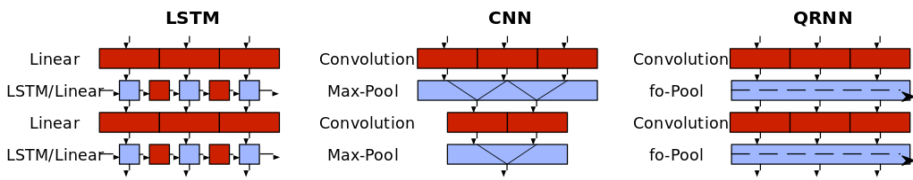

# Quasi-Recurrent Neural Networks

Tensorflow implementation of [Quasi-Recurrent Neural Networks](https://arxiv.org/abs/1611.01576) (QRNN).
The original blog post with code reference can be found [here](http://metamind.io/research/new-neural-network-building-block-allows-faster-and-more-accurate-text-understanding/).

A QRNN layer is composed of a convolutional stage (red blocks in the figure) and a pooling stage (blue blocks in the figure):

* The convolutional stage can perform the different activations in parallel (i.e. layer activations and gate activations) through time, such that each red sub-block is independent.

* The pooling stage imposes the ordering information across time, and although it is a sequential process (as depicted by the arrow) the heavy computation has already been performed in a single forward pass in the convolutional stage!

The figure below shows that QRNN is a mixture between CNN and LSTM, where we get the best of both worlds: make all activation computations in parallel with convolutions and merge sequentially, with no recursive weight operations.



The current implementation contains a language model prepared to work on Pen TreeBank (PTB) dataset.

To execute the PTB language model experiment:

`python train_lm.py`

The default parameters are set as those in the paper for the architecture w/ zoneout of `p = 0.1`. However, there are plenty of options available :)

NOTE: still have to achieve the results shown in the original paper.

```
usage: train_lm.py [-h] [--unrolled_lstm [UNROLLED_LSTM]] [--nounrolled_lstm]
                   [--epoch EPOCH] [--batch_size BATCH_SIZE]
                   [--seq_len SEQ_LEN] [--save_every SAVE_EVERY]
                   [--qrnn_size QRNN_SIZE] [--qrnn_layers QRNN_LAYERS]
                   [--qrnn_k QRNN_K] [--emb_dim EMB_DIM]
                   [--vocab_size VOCAB_SIZE] [--zoneout ZONEOUT]
                   [--dropout DROPOUT] [--learning_rate LEARNING_RATE]
                   [--learning_rate_decay LEARNING_RATE_DECAY]
                   [--grad_clip GRAD_CLIP] [--save_path SAVE_PATH]
                   [--data_dir DATA_DIR] [--train [TRAIN]] [--notrain]
                   [--test [TEST]] [--notest]

optional arguments:
  -h, --help            show this help message and exit
  --unrolled_lstm [UNROLLED_LSTM]
                        use a statically unrolled LSTM instead of dynamic_rnn
  --nounrolled_lstm
  --epoch EPOCH         Epochs to train (Def: 72).
  --batch_size BATCH_SIZE
                        Batch size (Def: 20).
  --seq_len SEQ_LEN     Max sequences length. Specified at bucketizing (Def:
                        105).
  --save_every SAVE_EVERY
                        Batch frequency to save model and summary (Def: 100).
  --qrnn_size QRNN_SIZE
                        Number of qrnn units per layer (Def: 640).
  --qrnn_layers QRNN_LAYERS
                        Number of qrnn layers (Def: 2).
  --qrnn_k QRNN_K       Width of QRNN filter (Def: 2).
  --emb_dim EMB_DIM     Embedding dimension (Def: 650).
  --vocab_size VOCAB_SIZE
                        Num words in vocab (Def: 10001).
  --zoneout ZONEOUT     Apply zoneout (dropout) to F gate (Def: 0)
  --dropout DROPOUT     Apply dropout in hidden layers (Def: 0.5)
  --learning_rate LEARNING_RATE
                        Beginning learning rate (Def: 1).
  --learning_rate_decay LEARNING_RATE_DECAY
                        After 6th epoch this factor is applied (Def: 0.95)
  --grad_clip GRAD_CLIP
                        Clip norm value (Def: 10).
  --save_path SAVE_PATH
                        Save path (Def: lm-qrnn_model).
  --data_dir DATA_DIR   Data dir containing train/valid/test.txt files (Def:
                        lm-qrnn_model).
  --train [TRAIN]       Flag for training (Def: True).
  --notrain
  --test [TEST]         Flag for testing (Def: True).
  --notest
```


##  Author

Santi Pdp ( [@santty128](https://twitter.com/santty128) )
